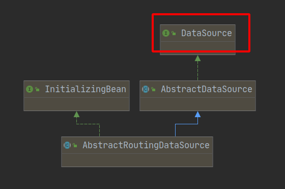

以mysql数据库集群为例，假设是一主一从，以事务属性或者自定义注解属性为依据来选择数据源，将不同属性对应的数据库请求分别路由到不同的数据库中。例如只读性的事务，完全可以把它对数据库的请求路由到从库中；而非只读性的操作，则可以路由到主库中。可以通过`AbstractRoutingDataSource`和spring aop来实现这个功能。

## 实现原理

1. 继承抽象类`AbstractRoutingDataSource`。
2. 拦截符合条件的方法。
3. 在方法执行前进行数据源切换。

### AbstractRoutingDataSource

这个类实现了`DataSource`接口，同时也重写了`DataSource`接口下的两个`getConnection`方法。

### 方法拦截

