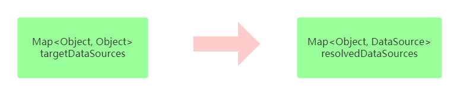

# Spring AOP实现数据库读写分离

读写分离实本质上就是把程序对数据库读操作和写操作分发到不同的数据库中。不同的数据库就是多个数据源，那`读写分离`这里就可以简单理解为多数据源问题。

在spring中，多数据源问题可以通过`AbstractRoutingDataSource`和spring aop来解决。

## 代码实现

1. 继承抽象类`AbstractRoutingDataSource`，实现`determineCurrentLookupKey`方法。
2. 创建切面拦截器，拦截符合条件的方法。
3. 在方法执行前后进行数据源切换。

配置文件：

```properties
# master
spring.datasource.master.url=jdbc:mysql://192.168.31.100:3306/test?autoReconnect=true
spring.datasource.master.username=root
spring.datasource.master.password=123456
spring.datasource.master.driver-class-name=com.mysql.jdbc.Driver
# slave
spring.datasource.slave.url=jdbc:mysql://192.168.31.101:3306/course-study?autoReconnect=true
spring.datasource.slave.username=root
spring.datasource.slave.password=123456
spring.datasource.slave.driver-class-name=com.mysql.jdbc.Driver
```

java相关配置类代码：

```java
public class DbProperties {
    private String url;
    private String username;
    private String password;
    private String driverClassName;
  	// 省略 getter 和 setter 方法
}

@Component
@ConfigurationProperties(prefix = "spring.datasource.master")
class MasterProperties extends DbProperties {
}

@Component
@ConfigurationProperties(prefix = "spring.datasource.slave")
class SlaveProperties extends DbProperties {
}

@Configuration
public class DataSourceConfig {
    public static final String MASTER = "master";
    public static final String SLAVE = "slave";

    /**
     * 主库数据源
     *
     * @param properties
     * @return
     */
    @Bean(MASTER)
    public DataSource master(MasterProperties properties) {
        return build(properties);
    }

    /**
     * 从库数据源
     *
     * @param properties
     * @return
     */
    @Bean(SLAVE)
    public DataSource slave(SlaveProperties properties) {
        return build(properties);
    }

    /**
     * 根据配置信息构建数据源
     *
     * @param properties
     * @return
     */
    private DataSource build(DbProperties properties) {
        return DataSourceBuilder
                .create()
                .url(properties.getUrl())
                .username(properties.getUsername())
                .password(properties.getPassword())
                .driverClassName(properties.getDriverClassName())
                .build();
    }
}


/**
 * todo 重点
 * 继承AbstractRoutingDataSource，实现determineCurrentLookupKey方法
 */
public class DynamicDataSource extends AbstractRoutingDataSource {
    @Override
    protected Object determineCurrentLookupKey() {
        return DataSourceContext.get();
    }
}

public class DataSourceContext {
    private static final ThreadLocal<String> datasource = new ThreadLocal<>();

    public static String get() {
        String key = datasource.get();
        return key == null ? "master" : key;
    }

    public static void setDatasource(String key) {
        datasource.set(key);
    }

    public static void clean() {
        datasource.remove();
    }
}

@Configuration
public class TransactionConfig {

    /**
     * 配置动态数据源
     *
     * @param master
     * @param slave
     * @return
     */
    @Bean
    public DynamicDataSource dynamic(
            @Autowired @Qualifier(MASTER) DataSource master,
            @Autowired @Qualifier(SLAVE) DataSource slave
    ) {
        Map<Object, Object> map = new HashMap<>();
        map.put(MASTER, master);
        map.put(SLAVE, slave);
        DynamicDataSource routing = new DynamicDataSource();
        routing.setTargetDataSources(map);
        routing.setDefaultTargetDataSource(master);
        return routing;
    }
    
    @Bean
    public PlatformTransactionManager platformTransactionManager(DynamicDataSource dataSource) {
        return new DataSourceTransactionManager(dataSource);
    }
}

// --------------------------------------------拦截器配置-----------------------------------------
public class DatasourceInterceptor implements MethodInterceptor {
    @Override
    public Object invoke(MethodInvocation invocation) throws Throwable {
        before(invocation.getMethod());
        Object invoke = null;
        try {
            invoke = invocation.proceed();
        } finally {
            after();
        }
        return invoke;
    }

    public void before(Method method) {
        //如果有事物注解，则优先使用事物注解的特性。如果事务属性为只读的，那毫无疑问可以把它对数据的请求打到从库
        Transactional transactional = method.getAnnotation(Transactional.class);
        if (transactional != null) {
            changeDatasource(transactional.readOnly() ? SLAVE : MASTER);
            return;
        }
        //这里是自定义属性，如果有的方法没有加事物注解，但是加了自定义注解的，那么就会走这段逻辑
        Datasource datasource = method.getAnnotation(Datasource.class);
        if (datasource != null && SLAVE.equals(datasource.value())) {
            changeDatasource(SLAVE);
        }
    }

    public void after() {
        // 清除数据源设置
        DataSourceContext.clean();
    }

    private void changeDatasource(String type) {
        DataSourceContext.setDatasource(type);
    }
}

public class DatasourceMethodPointcutAdvisor extends StaticMethodMatcherPointcutAdvisor {
    /**
     * 拦截规则：
     * 1: 接口类名上有 @Datasource 和 @Transactional 注解
     * 2: 接口方法名上有 @Datasource 和 @Transactional 注解
     *
     * @param method
     * @param targetClass
     * @return
     */
    @Override
    public boolean matches(Method method, Class<?> targetClass) {
        return methodCanPass(method) || classCanPass(method.getDeclaringClass());
    }

    private boolean methodCanPass(Method method) {
        return method.isAnnotationPresent(Datasource.class) || method.isAnnotationPresent(Transactional.class);
    }

    private boolean classCanPass(Class<?> clazz) {
        return clazz.isAnnotationPresent(Datasource.class) || clazz.isAnnotationPresent(Transactional.class);
    }
}
@Configuration
public class AopConfig {
    /**
     * DefaultAdvisorAutoProxyCreator 这个是一个可选配置项，如果在你的spring-boot项目中使用了下面任意一个注解的话，那么这个bean可以不用配置
     * @EnableTransactionManagement
     * @EnableAspectJAutoProxy
     * @EnableCaching
     */
    @Bean
    @Role(BeanDefinition.ROLE_INFRASTRUCTURE)
    public DefaultAdvisorAutoProxyCreator defaultAdvisorAutoProxyCreator() {
        // 这个类就是自动代理创建器，能够自动的为每个bean生成代理
        return new DefaultAdvisorAutoProxyCreator();
    }
    @Bean
    public DatasourceMethodPointcutAdvisor methodPointcutAdvisor(DatasourceInterceptor txInterceptor) {
        DatasourceMethodPointcutAdvisor advisor = new DatasourceMethodPointcutAdvisor();
        advisor.setAdvice(txInterceptor);
        return advisor;
    }
    @Bean
    public DatasourceInterceptor methodInterceptor() {
        return new DatasourceInterceptor();
    }
}


```


## AbstractRoutingDataSource详解


​																									（图-1）

当程序执行CURD操作时，就会调用`AbstractRoutingDataSource`类的`getConnection`方法来获取数据库连接`Connection`对象，最终通过该连接对象来访问数据库。而`AbstractRoutingDataSource`这个抽象类实现了`DataSource`接口，同时也实现了`DataSource`接口下的两个`getConnection`方法，源码如下：


​																									（图-2）


​																									（图-3）


​																									（图-4）

通过上面的源码可以看出，`DataSource`对象最终通过`determineCurrentLookupKey`这个方法确定。因此我们实现该方法就可以，此外，除了实现该方法外，还需要通过`setTargetDataSources`方法将所有的数据源以<key,value>的形式保存到这个对象里面。


​																									（图-5）


​																									（图-6）


​																									（图-7）

由于`AbstractRoutingDataSource`类同时还实现了`InitializingBean`接口，因此当这个bean实例化完成的时候，会触发`afterPropertiesSet`方法执行，该方法主要时通过`targetDataSources`生成`resolvedDataSources`对象，以及设置默认数据源。在（图-3）中的`determineTargetDataSource`方法中，会从`resolvedDataSources`对象中获取`DataSource`。



​																									（图-8）

## spring aop自定义方法拦截器

在本文的解决方案代码中并没有使用常规的aop拦截器写法，类似下面这种。因为在本解决方案中除了拦截了自定的`@Datasource`注解之外，还拦截了`@Transactional`注解。我们都知道`@Transactional`注解写在接口方法和实现类方法上是都可以生效的，那下面这种普通的aop写法对接口方法上的注解是无法拦截的，因此才使用了自定义方法拦截器的写法。

对于如何解决spring aop无法拦截接口方法上的注解问题，在[Spring AOP自定义方法拦截器](/spring/Spring AOP自定义方法拦截器/)这篇文章里面有详细说明。


```java
@Aspect
@Component
@EnableAspectJAutoProxy
public class DataSourceAspect {
 
    @Around("@annotation(com.xxx.Datasource)")
    public Object around(ProceedingJoinPoint joinPoint) throws Throwable {
        // 业务方法执行之前设置数据源...
        doingSomthingBefore();

        // 执行业务方法
        Object result = joinPoint.proceed();

        // 业务方法执行之后清除数据源设置...
        doingSomthingAfter();
        return result;
    }
}
```


