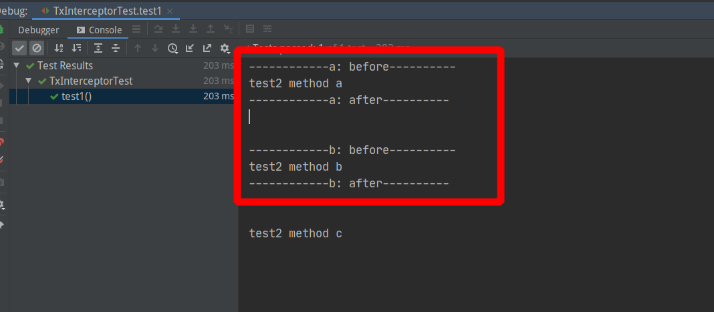

# Spring AOP自定义方法拦截器


最近在spring-boot项目中做mysql读写分离时遇到了一些问题，通过常规的spring aop无法拦截接口方法上的注解。针对这个问题，通用的解决方案是`自定义方法拦截器`。
本文将先给出具体的解决方案，然后再深入分析其中原理。

## 自定义方法拦截器

### 1、前置准备代码，启动类，业务代码，自定义注解等，这些都可以换成自己的。
```java
@SpringBootApplication
public class DefaultProxyCreatorApplication {
    public static void main(String[] args) {
        SpringApplication.run(DefaultProxyCreatorApplication.class, args);
    }
}

public interface Test2Service {
    /**
     * 被标记的方法
     */
    @Tx
    void a();

    void b();

    void c();
}

@Service
public class Test2ServiceImpl implements Test2Service {

    @Override
    public void a() {
        System.out.println("test2 method a");
    }

    /**
     * 被标记的方法
     */
    @Tx
    @Override
    public void b() {
        System.out.println("test2 method b");
    }

    @Override
    public void c() {
        System.out.println("test2 method c");
    }
}

@Documented
@Retention(RetentionPolicy.RUNTIME)
@Target({ElementType.METHOD, ElementType.TYPE})
public @interface Tx {
}
```
### 2、自定义拦截器核心代码
```java
public class TxInterceptor implements MethodInterceptor {
    @Override
    public Object invoke(MethodInvocation invocation) throws Throwable {
        String name = invocation.getMethod().getName();
        System.out.println(String.format("------------%s: before----------", name));
        Object object = invocation.proceed();
        System.out.println(String.format("------------%s: after----------", name));
        return object;
    }
}

public class TxMethodPointcutAdvisor extends StaticMethodMatcherPointcutAdvisor {
    /**
     * 拦截规则：
     * 1: 接口类名上有 @Tx 注解
     * 2: 接口方法名上有 @Tx 注解
     *
     * @param method
     * @param targetClass
     * @return
     */
    @Override
    public boolean matches(Method method, Class<?> targetClass) {
        return methodCanPass(method) || classCanPass(method.getDeclaringClass());
    }

    private boolean methodCanPass(Method method) {
        return method.isAnnotationPresent(Tx.class);
    }

    private boolean classCanPass(Class<?> clazz) {
        return clazz.isAnnotationPresent(Tx.class);
    }
}
```
### 3、配置方法拦截器，使其生效
```java
@Configuration
public class MethodInterceptorConfig {

    @Bean
    @Role(BeanDefinition.ROLE_INFRASTRUCTURE)
    public DefaultAdvisorAutoProxyCreator defaultAdvisorAutoProxyCreator() {
        // 这个类就是自动代理创建器，能够自动的为每个bean生成代理
        return new DefaultAdvisorAutoProxyCreator();
    }

    @Bean
    public TxMethodPointcutAdvisor methodPointcutAdvisor(TxInterceptor txInterceptor) {
        TxMethodPointcutAdvisor advisor = new TxMethodPointcutAdvisor();
        advisor.setAdvice(txInterceptor);
        return advisor;
    }

    @Bean
    public TxInterceptor methodInterceptor() {
        return new TxInterceptor();
    }
}
```
### 4、单元测试，功能验证
```java
@SpringBootTest
class TxInterceptorTest {

    @Autowired
    private Test2Service test2Service;

    @Test
    void test1() {
        test2Service.a();
        System.out.println("\n");
        test2Service.b();
        System.out.println("\n");
        test2Service.c();
    }
}
```
测试结果如下：



可以看到`service#a`和`service#b`这两个方法都被拦截到了。其中方法 a 的注解在接口上，方法b的注解在实现类上，可见问题已解决。

## 原理剖析

## 接口方法上的注解为什么失效

```java
@Aspect
@Component
@EnableAspectJAutoProxy
public class DataSourceAspect {
 
    @Around("@annotation(com.xxx.DataSource)")
    public Object around(ProceedingJoinPoint joinPoint) throws Throwable {
        // 业务方法执行之前设置数据源...
        doingSomthingBefore();

        // 执行业务方法
        Object result = joinPoint.proceed();

        // 业务方法执行之后清除数据源设置...
        doingSomthingAfter();
        return result;
    }
}
```
这是一段非常普通的spring aop拦截器代码，由于项目中使用的事务注解全部都是写在接口的方法上的，所以我也就习惯性的把注解`@DataSource`写在接口的方法上，一调试代码，这时候发现spring aop根本就不鸟你，拦截器没生效。网上一通搜索后，发现遇到这个问题的人非常多，答案也是五花八门，有的说是spring-boot 1.x版本的bug，升级到2.x版本就可以了。然后就屁颠屁颠的把spring-boot版本换成最新的`2.3.0.RELEASE`版本，根本就没用；也有人分析说aop代理的是spring的bean实例，然而接口很显然是不能实例化的，所以aop无法生效。查了很多，都是分析为什么不起作用的，可能是我搜索的关键字不对的原因，就没怎么看到有解决方案的帖子。
同样的写在接口方法上的`@Transactional`为什么就能生效呢（至于spring事务原理的解析这里就不讲了，网上一大把）？

## 源码

通过`@EnableTransactionManagement`进去看了下spring事务的源码，


上图中看到`@EnableTransactionManagement`注解上导入了一个类，不知道干什么的，点进去看看


`TransactionManagementConfigurationSelector`继承了`AdviceModeImportSelector`，就是想加载别的类，在`selectImports`方法返回的内容就是要加载的类，这里可以看到分别加载了`AutoProxyRegistrar`，`ProxyTransactionManagementConfiguration`这两个类，通过名字能猜出`ProxyTransactionManagementConfiguration`这个类应该是一个事务相关的配置类，继续点进去看下


点开`ProxyTransactionManagementConfiguration`类后，果然是一个配置类，在这个类中其实它主要是干了一件事，配置spring的`advisor`（增强器）。这里的`TransactionAttributeSource`表示事务属性源，它是用来生成事务相关的属性的，比如什么事务是否为只读啊，传播特性啊等等，都是通过这个接口来获取的，那这个接口有很多实现类，如图：


这里默认是用的`AnnotationTransactionAttributeSource`注解事务属性源，换句话说，这个类就是用来处理`@Transactional`注解的。
刚刚的`ProxyTransactionManagementConfiguration`配置类中还有一个bean，`TransactionInterceptor`事务拦截器，这个类才是真正的处理事务相关的一切逻辑的，可以看下一它的类图结构，


可以看到`TransactionInterceptor`继承了`TransactionAspectSupport`类和实现了`MethodInterceptor`接口，其中`TransactionAspectSupport`是提供事务支持的，`MethodInterceptor`是用来拦截加了``@Transactional``注解的方法的，职责分明。那这里知道了这个方法拦截器后我们就可以做一些骚操作了。

这里我们先回到我们的需求点上，我们要做的是实现程序自动读写分离，那么读写分离的本质是啥，不就是切换数据源么，我不会告诉你怎么实现多数据源切换的（我也不知道，动态数据源方案网上又是一大把的，但是有的是有坑的，比如为什么你配了动态数据源加上事务注解之后就无效了呢，去掉事务注解又可以了，是不是很蛋疼。动态切换数据源的关键点在于：`在适当的时机切换数据源`）。那我这里的遇到的问题是`无法拦截接口上的注解`（其实你把注解放到实现类的方法上，啥事儿都没了。但我这个人就是喜欢杠，非要放到接口方法上）

那怎么搞定这个问题呢，其实通过上面对事务源码的简单分析之后大致可以得出以下结论：
```
重写事务拦截器，在事务处理的前后加上自己的逻辑，切换数据源。然后将自己重写的事务拦截器设置到刚开始的 advisor 中就可已了
```

## 初步解决方案

### 重写事务拦截器

```java
public class CustomInterceptor extends TransactionInterceptor {

    private static final long serialVersionUID = 1154144110124764905L;

    public CustomInterceptor(PlatformTransactionManager ptm, TransactionAttributeSource tas) {
        super(ptm, tas);
    }

    @Override
    public Object invoke(MethodInvocation invocation) throws Throwable {
        before(invocation.getMethod());
        Object invoke = null;
        try {
            invoke = super.invoke(invocation);
        } finally {
            after();
        }
        return invoke;
    }

    public void before(Method method) {
        // 这里都拿到method对象了，那通过反射可以做的事情就很多了，能到这里来的，那方法上面肯定是有Transactional注解的，拿到它并获取相关属性，如果事务属性为只读的，那毫无疑问可以把它对数据的请求打到从库
        Transactional transactional = method.getAnnotation(Transactional.class);
        boolean readOnly = transactional.readOnly();
        if (readOnly) {
            // 只读事务，切换到mysql的从库
            changeDatasource(DatasourceType.SLAVE);
        } else {
            // 非只读事务，切换到mysql主库
            changeDatasource(DatasourceType.MASTER);
        }
    }

    public void after() {
        // 清除数据源设置
        changeDatasource(DatasourceType.CLEAN);
    }

    private void changeDatasource(DatasourceType type) {
        //模拟数据源切换
        System.out.println("\n\n\n===========================================================");
        System.out.println("Datasource = " + type);
        System.out.println("===========================================================\n\n\n");
    }
}

enum DatasourceType {
    MASTER, SLAVE, CLEAN
}
```
### 设置拦截器

将自己重写后的事务拦截器设置到`advisor`中，将它默认的覆盖掉

```java
@Configuration
public class TransactionConfig implements InitializingBean, BeanFactoryAware {
    @Override
    public void afterPropertiesSet() throws Exception {
        // 获取增强器
        BeanFactoryTransactionAttributeSourceAdvisor advisor = factory.getBean(BeanFactoryTransactionAttributeSourceAdvisor.class);
        PlatformTransactionManager platformTransactionManager = factory.getBean(PlatformTransactionManager.class);
        // spring原有的事务拦截器用的就是注解类型的事务属性源，那我们也用这个，不然你的事务注解就失效了，那不就白忙活了么
        TransactionAttributeSource attributeSource = new AnnotationTransactionAttributeSource();
        // 实例化自己的事务拦截器
        CustomInterceptor advice = new CustomInterceptor(platformTransactionManager, attributeSource);
        // 把它原有的事务拦截器替换成自己的，因为你重写的事务拦截是继承它原有的，所以可以这么搞
        advisor.setAdvice(advice);
    }

    private DefaultListableBeanFactory factory;

    @Override
    public void setBeanFactory(BeanFactory beanFactory) throws BeansException {
        if (beanFactory instanceof DefaultListableBeanFactory) {
            this.factory = (DefaultListableBeanFactory) beanFactory;
        }
    }
}
```

到这里，对于接口上有事务注解的方法，我们已经可以动态的切换它的数据源了，而且还可以不用自定注解，直接用spring自带的注解就好。
		那经过上面的一顿操作后，终于可以在事务的前后做自己的事情了。

从某种意义上来将，这个方案确实解决了接口方法上的注解问题，但也只是仅限于spring的事务注解。那对于本文标题所述的问题，在本质上并没有得到解决，因为事务这里是spring-transaction模块实现的注解处理，我们这里只是用了一种投机取巧的方法达到了目的而已。

## 通用解决方案

所谓通用解决方案就是模仿spring-transaction写一个自己的方法拦截器，那这里就不限于注解了，通过注解也是可以的，只不过除了接口方法上的注解无法直接通过spring aop拦截外，其他的方式好像都可以通过spring aop直接实现。

实现一个自定义的方法拦截器：

1. 创建`ProxyFactoryBean`
2. 
需要有一个`Advisor`对象（`AbstractBeanFactoryPointcutAdvisor`），然后把这个advisor对象设置到`ProxyFactoryBean`中
3. 需要有一个`PointCut`对象（`StaticMethodMatcherPointcut`），将其设置到 advisor 对象中
4. 需要有一个`Advice`对象（`MethodInterceptor`），将其设置到 advisor 对象中


### demo

```java
/**
 * 业务接口
 */
interface Service {
    void test1();
    /**
     * 打上标记，需要被拦截的方法
     */
    @DataSource
    void test2();
}
/**
 * 业务实现
 */
class ServiceImpl implements Service {
    @Override
    public void test1() {
        System.out.println("hello world");
    }
    @Override
    public void test2() {
        System.out.println("I'm doing something in DB");
    }
}

/**
 * 方法拦截标记
 */
@Documented
@Retention(RetentionPolicy.RUNTIME)
@Target({ElementType.TYPE, ElementType.METHOD})
@interface DataSource {
}

class DataSourceAdvisor extends AbstractBeanFactoryPointcutAdvisor {

    private DataSourcePointCut pointCut;

    public void setPointCut(DataSourcePointCut pointCut) {
        this.pointCut = pointCut;
    }

    @Override
    public Pointcut getPointcut() {
        return pointCut;
    }
}

class DataSourceInterceptor implements MethodInterceptor {
    @Override
    public Object invoke(MethodInvocation invocation) throws Throwable {
        String name = invocation.getMethod().getName();
        System.out.println("==============" + name + " before ================");
        Object result = invocation.proceed();
        System.out.println("==============" + name + " after ================");
        return result;
    }
}

class DataSourcePointCut extends StaticMethodMatcherPointcut {

    /**
     * 方法匹配器，这个才是真正起作用的主
     *
     * @param method
     * @param targetClass
     * @return
     */
    @Override
    public boolean matches(Method method, Class<?> targetClass) {
        return method.isAnnotationPresent(DataSource.class);
    }
}

/**
 * 单元测试
 */
public class MethodInterceptorTest {

    private ProxyFactoryBean proxyFactoryBean;

    @BeforeEach
    public void before() {
        Service service = new ServiceImpl();
        ProxyFactoryBean pfb = new ProxyFactoryBean();
        // 设置哪个对象需要被代理
        pfb.setTarget(service);

        // 初始化 advisor
        DataSourceAdvisor advisor = new DataSourceAdvisor();
        // 设置pointcut
        advisor.setPointCut(new DataSourcePointCut());
        // 设置方法拦截器
        advisor.setAdvice(new DataSourceInterceptor());

        // 将advisor添加到代理中
        pfb.addAdvisor(advisor);

        proxyFactoryBean = pfb;
    }

    @Test
    public void test() {
        // 通过代理生成 service 实例
        Service proxy = (Service) proxyFactoryBean.getObject();
        proxy.test1();
        System.out.println("\n\n");
        proxy.test2();
    }
}

```


测试结果如下：


可以看到成功的拦截到了`service#test2`方法。实现方法拦截就这么几个步骤，这是一个bean，但是在实际的企业级开发中，这么写很显然不现实，在实际开发中要是这么写，那就离拎盒饭不远了...

### Pro版

在这个版本中我们只需要解决一件事情，那就是让spring能够自动为我们创建`ProxyFactoryBean`

```java
@SpringBootApplication
public class DefaultProxyCreatorApplication {
    public static void main(String[] args) {
        SpringApplication.run(DefaultProxyCreatorApplication.class, args);
    }
}

public interface Test2Service {
    /**
     * 被标记的方法
     */
    @Tx
    void a();

    void b();

    void c();
}

@Service
public class Test2ServiceImpl implements Test2Service {

    @Override
    public void a() {
        System.out.println("test2 method a");
    }

    /**
     * 被标记的方法
     */
    @Tx
    @Override
    public void b() {
        System.out.println("test2 method b");
    }

    @Override
    public void c() {
        System.out.println("test2 method c");
    }
}


@Documented
@Retention(RetentionPolicy.RUNTIME)
@Target({ElementType.METHOD, ElementType.TYPE})
public @interface Tx {
}

public class TxInterceptor implements MethodInterceptor {
    @Override
    public Object invoke(MethodInvocation invocation) throws Throwable {
        String name = invocation.getMethod().getName();
        System.out.println(String.format("------------%s: before----------", name));
        Object object = invocation.proceed();
        System.out.println(String.format("------------%s: after----------", name));
        return object;
    }
}

public class TxMethodPointcutAdvisor extends StaticMethodMatcherPointcutAdvisor {
    /**
     * 拦截规则：
     * 1: 接口类名上有 @Tx 注解
     * 2: 接口方法名上有 @Tx 注解
     *
     * @param method
     * @param targetClass
     * @return
     */
    @Override
    public boolean matches(Method method, Class<?> targetClass) {
        return methodCanPass(method) || classCanPass(method.getDeclaringClass());
    }

    private boolean methodCanPass(Method method) {
        return method.isAnnotationPresent(Tx.class);
    }

    private boolean classCanPass(Class<?> clazz) {
        return clazz.isAnnotationPresent(Tx.class);
    }
}

@Configuration
public class AopConfig {

    @Bean
    @Role(BeanDefinition.ROLE_INFRASTRUCTURE)
    public DefaultAdvisorAutoProxyCreator defaultAdvisorAutoProxyCreator() {
        // 这个类就是自动代理创建器，能够自动的为每个bean生成代理
        return new DefaultAdvisorAutoProxyCreator();
    }

    @Bean
    public TxMethodPointcutAdvisor methodPointcutAdvisor(TxInterceptor txInterceptor) {
        TxMethodPointcutAdvisor advisor = new TxMethodPointcutAdvisor();
        advisor.setAdvice(txInterceptor);
        return advisor;
    }

    @Bean
    public TxInterceptor methodInterceptor() {
        return new TxInterceptor();
    }
}
```

创建一个单元测试验证功能

```java
@SpringBootTest
class TxInterceptorTest {

    @Autowired
    private Test2Service test2Service;

    @Test
    void test1() {
        test2Service.a();
        System.out.println("\n");
        test2Service.b();
        System.out.println("\n");
        test2Service.c();
    }
}
```

单元测试结果如下：


可以看到`service#a`和`service#b`这两个方法都被拦截到了。其中方法 a 的注解在接口上，方法b的注解在实现类上，可见这已经达到了我的目的，成功的拦截到了接口方法上的注解。

### 注意细节

那如果说仅仅将上面的配置代码复制到项目中去用的话，是可以拦截接口方法注解的，但是如果要和spring的事务注解一起用的话，那么你可能要失望了，因为它会先经过事务的拦截，然后才到你的自定义拦截器，要解决这个问题很简单，将advisor设置一个执行顺序就可以了

```java
    @Bean
    public TxMethodPointcutAdvisor methodPointcutAdvisor(TxInterceptor txInterceptor) {
        TxMethodPointcutAdvisor advisor = new TxMethodPointcutAdvisor();
        advisor.setAdvice(txInterceptor);
        advisor.setOrder(1);//设置顺序，值越小，优先级越高，也就是越被先执行
        return advisor;
    }
```

`advisor.setOrder(1)`
那这个值是怎么取的呢，难道设置成1就一定会被先执行么，


从这里可以看到spring事务的advisor执行顺序值为Integer的最大值，所以也就是你随便设置一个值（只要它不是Integer.MAX_VALUE），它都会比spring事务拦截器先执行。
